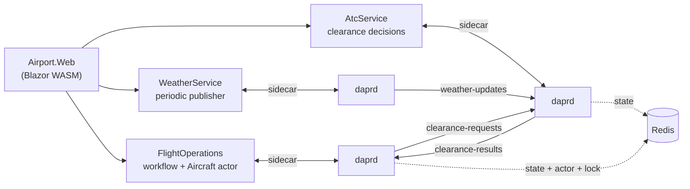
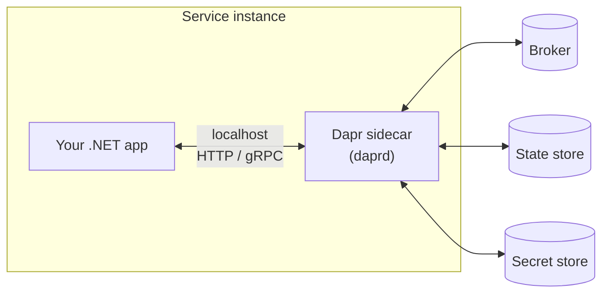

# Dapr + Aspire
## Distributed Systems Without the Headache
Florian van Dillen - Cloud Solution Architect

dotnetfriday — June 2026

---

# Agenda

1. **The pain** — why distributed systems eat your week
2. **Meet the airport** — the demo app we'll dissect for the rest of the talk
3. **Dapr** — sidecar, building blocks, components
4. **Aspire** — AppHost, ServiceDefaults, the Dapr integration
5. **Observability** — OpenTelemetry, sidecar traces, custom metrics
6. **Building blocks in action** — pub/sub, state, event-driven workflows
7. *Bonus:* **Workflows + Actors**

---

# Distributed Systems Are Hard

Every service ends up solving the same boring problems:

- Service discovery, retries, timeouts, circuit breakers
- Pub/sub with at-least-once delivery and dead letters
- Durable state with concurrency and TTLs
- Secrets, configuration, feature flags
- Local dev: ten services, three brokers, two databases — yikes
- Observability bolted on **after** the incident

> Plumbing eats the feature backlog.

---

# Meet The Airport

A tiny distributed system that exercises every Dapr building block we'll discuss.



- One **Aspire AppHost** boots everything (services + sidecars + dashboard).
- Three Dapr **building blocks** in active use: pub/sub, state store, distributed lock, plus actors and workflows.
- Live UI: departure board, ATC tower, weather control panel.

---

# What Is Dapr?

**Distributed Application Runtime** — portable building blocks for microservices.

- **Language-agnostic** — call it over HTTP or gRPC
- **Sidecar architecture** — runs next to your app, not inside it
- **Building blocks** — pub/sub, state, service invocation, bindings, secrets, workflows
- **Components** — pluggable infrastructure (Redis, Service Bus, Kafka, Cosmos, …)
- **Open source, CNCF graduated** — runs anywhere: dev box, Kubernetes, Azure Container Apps

---

# The Sidecar Pattern



- App speaks **one consistent API** — the sidecar translates to real infra.
- Swap Redis for Service Bus → no app code change.
- Sidecar handles **mTLS, retries, tracing** out of the box.

---

# Building Blocks & Components

| Building block | What it does | Example components |
|---|---|---|
| Service invocation | Call other services by name | Built-in (HTTP/gRPC + mTLS) |
| Pub/Sub | Async messaging, CloudEvents | Redis, Service Bus, Kafka, RabbitMQ |
| State management | Durable KV with ETag / TTL | Redis, Cosmos DB, Postgres |
| Distributed lock | Mutual exclusion across instances | Redis, Cosmos DB |
| Actors | Per-entity state + behavior | Built-in (state-store backed) |
| Workflows | Durable code-first orchestrations | Built-in (actor-based) |

A **component** is a YAML manifest that binds a building block to a real backend.
In the airport demo, every component is backed by the Redis that `dapr init` provisions.

---

# What Is .NET Aspire?

An **opinionated stack** for building observable, cloud-ready distributed .NET apps — locally and in production.

You get:

- A **single F5** that boots every service, container, and dependency
- A **dashboard** with logs, traces, metrics, and resource health
- Sensible defaults for **OpenTelemetry, health checks, service discovery, resilience**
- A growing catalog of **integrations** for common infrastructure

> Aspire is *not* a runtime. It's a developer-experience and composition toolkit.

---

# The AppHost

A regular **.NET console project** that *describes* your distributed app in C#.

```csharp
var builder = DistributedApplication.CreateBuilder(args);

var redis = builder.AddRedis("redis");

var api = builder.AddProject<Projects.OrdersApi>("orders-api")
                 .WithReference(redis);

builder.AddProject<Projects.OrdersWorker>("orders-worker")
       .WithReference(redis)
       .WaitFor(api);

builder.Build().Run();
```

- Declarative model of **resources + relationships**.
- Runs containers, projects, executables, and cloud emulators together.
- One entry point for the entire distributed app.

---

# ServiceDefaults

A **shared project** every service references — cross-cutting concerns in one place.

```csharp
// Program.cs of every service
builder.AddServiceDefaults();
// …
app.MapDefaultEndpoints(); // /health, /alive
```

Out of the box:

- **OpenTelemetry** — traces, metrics, logs to OTLP
- **Health checks** — liveness + readiness endpoints
- **Service discovery** — name-based `HttpClient` resolution
- **Resilience** — sensible retries and timeouts on outbound HTTP

> Demo: open `Airport.ServiceDefaults/Extensions.cs` and look at the OTel block.

---

# Integrations: Hosting vs Client

Two halves of every Aspire integration:

| Side | Package pattern | Lives in | Job |
|---|---|---|---|
| **Hosting** | `Aspire.Hosting.X` | AppHost | *Model* the resource (container, connection string, dependencies) |
| **Client** | `Aspire.X` *(or community equivalent)* | The service | *Wire it up* (DI, config, health, OTel) |

```csharp
// AppHost (hosting)
var cache = builder.AddRedis("cache");
builder.AddProject<Projects.Api>("api").WithReference(cache);

// Api/Program.cs (client)
builder.AddRedisClient("cache");
```

Same name on both sides — Aspire injects the connection details.

---

# Aspire ❤️ Dapr

`CommunityToolkit.Aspire.Hosting.Dapr` makes sidecars first-class AppHost resources.

```csharp
DaprSidecarOptions SidecarFor(string appId) => new()
{
    AppId = appId,
    ResourcesPaths = [daprComponentsPath],
    Config = tracingConfigPath,
};

builder.AddProject<Projects.Airport_WeatherService>("weather-service")
       .WithHttpEndpoint(port: 5081, name: "http")
       .WithDaprSidecar(SidecarFor("weather-service"));
```

- **No more `dapr run` scripts** — sidecars start with the app.
- Components are pointed at via `ResourcesPaths` (or modeled in C#).
- Sidecars show up in the **Aspire dashboard** with their own logs and traces.
- Same definition works for local dev *and* Container Apps deployment.

> Demo: this is exactly what `Airport.AppHost/AppHost.cs` does.

---

# Observability Is Non-Negotiable

In a distributed system, a single request crosses **N services + N sidecars + brokers**.

Without correlated telemetry, you're stuck with:

- "It works on my machine" — but where did it actually break?
- Per-service logs with no shared identifier
- Metrics that only describe one hop
- Hours of grep when something fails at 03:00

What you need:

- **Traces** that span services *and* sidecars
- **Logs** correlated by trace ID
- **Metrics** for both technical SLOs *and* business outcomes

---

# OpenTelemetry in Aspire

`AddServiceDefaults()` already configured OTel for you:

- ASP.NET Core, `HttpClient`, runtime metrics — instrumented automatically
- Exports via **OTLP** to the Aspire dashboard (and any other collector)
- Trace context **propagates through Dapr sidecars** (W3C `traceparent`)

```csharp
// Inside ServiceDefaults — already there
builder.Services.AddOpenTelemetry()
    .WithMetrics(m => m.AddAspNetCoreInstrumentation()
                       .AddHttpClientInstrumentation()
                       .AddRuntimeInstrumentation()
                       .AddMeter("Airport"))           // ← our custom meter
    .WithTracing(t => t.AddAspNetCoreInstrumentation()
                       .AddHttpClientInstrumentation()
                       .AddSource("Airport"));         // ← our custom source
```

One request → one trace → every hop visible in the dashboard.

---

# Custom Metrics With `Meter`

Defaults describe *how* the system is running. Custom metrics describe *what the business cares about*.

```csharp
public static class AirportTelemetry
{
    public static readonly Meter Meter = new("Airport");

    public static readonly Counter<long> ClearanceDecisions =
        Meter.CreateCounter<long>("airport.atc.clearance_decisions");

    public static readonly Histogram<double> ClearanceDecisionDurationMs =
        Meter.CreateHistogram<double>("airport.atc.clearance_decision_duration", unit: "ms");
}
```

- One static `Meter` per logical area, shared via `Airport.Contracts`.
- Register the meter name in OTel: `.AddMeter("Airport")`.
- Tag each measurement (kind, runway, granted) for slice-and-dice in the dashboard.

> Demo: open `AirportTelemetry.cs` to see the real instruments.

---

# Pub/Sub With Dapr

One API. Many brokers. CloudEvents on the wire.

```csharp
// WeatherService — publisher
await dapr.PublishEventAsync("pubsub", "weather-updates", snapshot);

// AtcService — subscriber (Dapr.AspNetCore)
app.MapPost("/atc/weather-updates",
    (WeatherSnapshot snapshot, WeatherWatch watch) =>
{
    watch.Observe(snapshot);
    return Results.Ok();
})
.WithTopic("pubsub", "weather-updates");
```

- **Decoupled** — publisher doesn't know who subscribes.
- **Component swap** — Redis Streams locally → Service Bus or Kafka in prod.
- **Delivery guarantees, dead letters, bulk subscribe** — set on the component.

> Demo: pin bad weather, watch ATC's "below minima" flag flip within one tick.

---

# State Management With Dapr

Durable key-value with the same API regardless of backend.

```csharp
// AtcService — persist active clearances
var map = await dapr.GetStateAsync<Dictionary<string, ActiveClearance>>(
    "statestore", "active-clearances") ?? new();

map[request.FlightId] = new ActiveClearance(/* … */);

await dapr.SaveStateAsync("statestore", "active-clearances", map);
```

- **ETags** for optimistic concurrency, **TTL** for expiry, **bulk** ops for throughput.
- Components: Redis, Cosmos DB, Postgres, SQL Server, Azure Table Storage, …
- Some components also support **query** and **transactions**.

> Demo: granted clearances on the `/atc` page are read back from this exact key.

---

# Weather Events Drive the Workflow

Publish once. ATC and FlightOperations react independently.

```csharp
// FlightOperations subscriber — after persisting the newest snapshot
await workflows.RaiseEventAsync(flightId, "weather-updated", true);

// Workflow activity — read the latest received weather from the state store
var snapshot = await snapshots.GetLatestAsync();
```

The weather gate:

- **Durable snapshot** — available to new flights and after a service restart
- **External event** — weather changes wake the hold immediately
- **Safe waits** — missing or bad weather cannot silently grant takeoff
- **Bounded retries** — timer or operator advance; release the gate on cancellation

> Demo: pause publishing, pin Fog, advance past boarding, then choose CAVOK. Watch the flight progress without a service-invocation call.

---

# Bonus: Dapr Workflows + Actors

**Durable orchestrations** on top of **per-entity state**.

```csharp
public sealed class FlightWorkflow : Workflow<FlightWorkflowInput, FlightWorkflowResult>
{
    public override async Task<FlightWorkflowResult> RunAsync(
        WorkflowContext context, FlightWorkflowInput input)
    {
        await context.CallActivityAsync(nameof(InitializeAircraftActivity), /*…*/);
        await context.CallActivityAsync(nameof(TryAcquireGateActivity),     /*…*/);
        await context.CallActivityAsync(nameof(CheckWeatherActivity),       /*…*/);
        await context.CallActivityAsync(nameof(RequestClearanceActivity),   /*…*/);
        await context.WaitForExternalEventAsync<ClearanceResult>("clearance-takeoff");
        // …cruise…landing clearance…land.
        return new FlightWorkflowResult(true, "Landed");
    }
}
```

- Workflow survives **process restarts** — state is persisted by Dapr.
- Each flight has a matching **Aircraft actor** that owns its mutable state.
- Same sidecar, same component model — nothing extra to deploy.

> Demo: schedule a flight, watch the actor's status walk the board live.

---

# Recap

- **Dapr** — portable building blocks (pub/sub, state, invocation, lock, actors, workflows) behind a sidecar.
- **Aspire** — AppHost + ServiceDefaults + dashboard you'll actually open.
- **Together** — one `aspire run` boots services *and* sidecars, OpenTelemetry wired end-to-end.
- **Observability** is first-class — including the custom metrics that describe your business.
- **Adopt incrementally** — start with one building block, one workflow, one team.

## Questions?

Code: https://github.com/fvandillen/dapr-aspire-airport