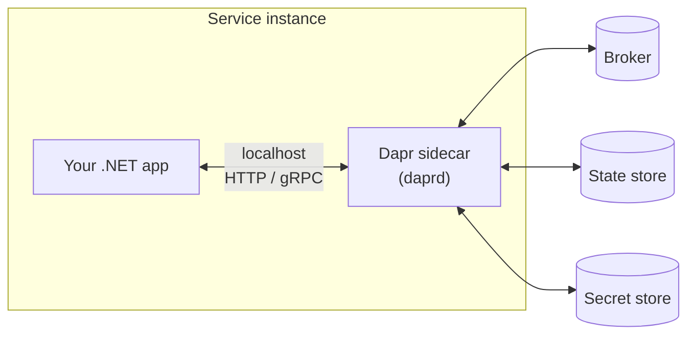
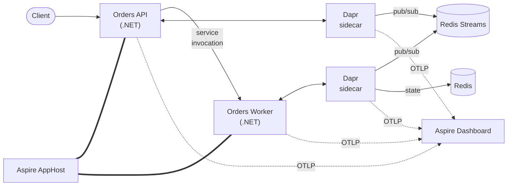

# Dapr + Aspire
## Distributed Systems Without the Headache

.NET Friday — June 2026

---

# Agenda

1. **Dapr** — sidecar, building blocks, components, .NET SDK
2. **Aspire** — AppHost, ServiceDefaults, hosting & client integrations
3. **Aspire + Dapr** — the easy button
4. **OpenTelemetry** — distributed observability + custom metrics
5. **Pub/Sub** with Dapr
6. **State store** with Dapr
7. **Service-to-service** invocation with Dapr
8. *Bonus:* **Dapr Workflows**

---

# Distributed Systems Are Hard

Every service ends up solving the same boring problems:

- Service discovery, retries, timeouts, circuit breakers
- Pub/sub with at-least-once delivery and dead letters
- Durable state with concurrency and TTLs
- Secrets, configuration, feature flags
- Local dev: ten services, three brokers, two databases — yikes
- Observability bolted on **after** the incident

> Plumbing eats the feature backlog.

---

# What Is Dapr?

**Distributed Application Runtime** — portable building blocks for microservices.

- **Language-agnostic** — call it over HTTP or gRPC
- **Sidecar architecture** — runs next to your app, not inside it
- **Building blocks** — pub/sub, state, service invocation, bindings, secrets, workflows
- **Components** — pluggable infrastructure (Redis, Service Bus, Kafka, Cosmos, …)
- **Open source, CNCF graduated** — runs anywhere: dev box, Kubernetes, Azure Container Apps

---

# The Sidecar Pattern



- App speaks **one consistent API** — the sidecar translates to real infra.
- Swap Redis for Service Bus → no app code change.
- Sidecar handles **mTLS, retries, tracing** out of the box.

---

# Building Blocks & Components

| Building block | What it does | Example components |
|---|---|---|
| Service invocation | Call other services by name | Built-in (HTTP/gRPC + mTLS) |
| Pub/Sub | Async messaging, CloudEvents | Redis, Service Bus, Kafka, RabbitMQ |
| State management | Durable KV with ETag / TTL | Redis, Cosmos DB, Postgres |
| Bindings | Trigger / output to external systems | Blob, Event Grid, Cron, … |
| Secrets | Read secrets from a store | Key Vault, env vars, local file |
| Workflows | Durable code-first orchestrations | Built-in (actor-based) |

A **component** is a YAML manifest that binds a building block to a real backend.

---

# Using Dapr From .NET

You don't have to talk HTTP yourself — there's an SDK.

```csharp
// Program.cs
builder.Services.AddDaprClient();

// In a service
public class OrderService(DaprClient dapr)
{
    public Task PublishOrderAsync(Order order) =>
        dapr.PublishEventAsync("pubsub", "orders.created", order);

    public Task<Cart?> GetCartAsync(string id) =>
        dapr.GetStateAsync<Cart>("statestore", id);
}
```

- `Dapr.Client` — wraps the sidecar over **gRPC** (HTTP fallback).
- `Dapr.AspNetCore` — `[Topic]`, `MapSubscribeHandler()`, model binding for subscriptions.
- Every interaction is **just a typed call** — the sidecar does the heavy lifting.

---

# What Is .NET Aspire?

An **opinionated stack** for building observable, cloud-ready distributed .NET apps — locally and in production.

You get:

- A **single F5** that boots every service, container, and dependency
- A **dashboard** with logs, traces, metrics, and resource health
- Sensible defaults for **OpenTelemetry, health checks, service discovery, resilience**
- A growing catalog of **integrations** for common infrastructure

> Aspire is *not* a runtime. It's a developer-experience and composition toolkit.

---

# The AppHost

A regular **.NET console project** that *describes* your distributed app in C#.

```csharp
var builder = DistributedApplication.CreateBuilder(args);

var redis = builder.AddRedis("redis");

var api = builder.AddProject<Projects.OrdersApi>("orders-api")
                 .WithReference(redis);

builder.AddProject<Projects.OrdersWorker>("orders-worker")
       .WithReference(redis)
       .WaitFor(api);

builder.Build().Run();
```

- Declarative model of **resources + relationships**.
- Runs containers, projects, executables, and cloud emulators together.
- One entry point for the entire distributed app.

---

# ServiceDefaults

A **shared project** every service references — cross-cutting concerns in one place.

```csharp
// Program.cs of every service
builder.AddServiceDefaults();
// …
app.MapDefaultEndpoints(); // /health, /alive
```

Out of the box:

- **OpenTelemetry** — traces, metrics, logs to OTLP
- **Health checks** — liveness + readiness endpoints
- **Service discovery** — name-based `HttpClient` resolution
- **Resilience** — sensible retries and timeouts on outbound HTTP

Customize once, every service inherits.

---

# Integrations: Hosting vs Client

Two halves of every Aspire integration:

| Side | Package pattern | Lives in | Job |
|---|---|---|---|
| **Hosting** | `Aspire.Hosting.X` | AppHost | *Model* the resource (container, connection string, dependencies) |
| **Client** | `Aspire.X` *(or community equivalent)* | The service | *Wire it up* (DI, config, health, OTel) |

```csharp
// AppHost (hosting)
var cache = builder.AddRedis("cache");
builder.AddProject<Projects.Api>("api").WithReference(cache);

// Api/Program.cs (client)
builder.AddRedisClient("cache");
```

Same name on both sides — Aspire injects the connection details.

---

# Aspire ❤️ Dapr

`CommunityToolkit.Aspire.Hosting.Dapr` makes sidecars first-class AppHost resources.

```csharp
var stateStore = builder.AddDaprStateStore("statestore");
var pubsub     = builder.AddDaprPubSub("pubsub");

builder.AddProject<Projects.OrdersApi>("orders-api")
       .WithDaprSidecar()
       .WithReference(stateStore)
       .WithReference(pubsub);
```

- **No more `dapr run` scripts** — sidecars start with the app.
- Components modeled in C#, generated as YAML for `daprd`.
- Sidecars show up in the **Aspire dashboard** with their own logs and traces.
- Same definition works for local dev *and* Container Apps deployment.

---

# What We're Building Today



> Aspire wires it. Dapr runs it. OpenTelemetry observes it.

---

# Observability Is Non-Negotiable

In a distributed system, a single request crosses **N services + N sidecars + brokers**.

Without correlated telemetry, you're stuck with:

- "It works on my machine" — but where did it actually break?
- Per-service logs with no shared identifier
- Metrics that only describe one hop
- Hours of grep when something fails at 03:00

What you need:

- **Traces** that span services *and* sidecars
- **Logs** correlated by trace ID
- **Metrics** for both technical SLOs *and* business outcomes

---

# OpenTelemetry in Aspire

`AddServiceDefaults()` already configured OTel for you:

- ASP.NET Core, `HttpClient`, runtime metrics — instrumented automatically
- Exports via **OTLP** to the Aspire dashboard (and any other collector)
- Trace context **propagates through Dapr sidecars** (W3C `traceparent`)

```csharp
// Inside ServiceDefaults — already there
builder.Services.AddOpenTelemetry()
    .WithMetrics(m => m.AddAspNetCoreInstrumentation()
                       .AddHttpClientInstrumentation()
                       .AddRuntimeInstrumentation())
    .WithTracing(t => t.AddAspNetCoreInstrumentation()
                       .AddHttpClientInstrumentation()
                       .AddSource("Dapr.*"));
```

One request → one trace → every hop visible in the dashboard.

---

# Custom Metrics With `Meter`

Defaults describe *how* the system is running. Custom metrics describe *what the business cares about*.

```csharp
public class OrderMetrics
{
    private readonly Counter<long> _ordersPlaced;
    private readonly Histogram<double> _orderTotal;

    public OrderMetrics(IMeterFactory factory)
    {
        var meter = factory.Create("Orders");
        _ordersPlaced = meter.CreateCounter<long>("orders.placed");
        _orderTotal   = meter.CreateHistogram<double>("orders.total", unit: "EUR");
    }

    public void Record(Order o)
    {
        _ordersPlaced.Add(1, new KeyValuePair<string, object?>("region", o.Region));
        _orderTotal.Record(o.Total);
    }
}
```

- Use `IMeterFactory` so tests can isolate meters.
- Register the meter name in OTel: `.AddMeter("Orders")`.
- Visible in the Aspire dashboard immediately.

---

# Pub/Sub With Dapr

One API. Many brokers. CloudEvents on the wire.

```csharp
// Publisher
await dapr.PublishEventAsync("pubsub", "orders.created", order);

// Subscriber (Dapr.AspNetCore)
app.MapPost("/orders.created",
    [Topic("pubsub", "orders.created")] (OrderCreated evt) => HandleAsync(evt));
```

- **Decoupled** — publisher doesn't know who subscribes.
- **Component swap** — Redis Streams locally → Service Bus or Kafka in prod.
- **Delivery guarantees, dead letters, bulk subscribe** — set on the component.

> Demo: API publishes `orders.created`, Worker reacts and updates state.

---

# State Management With Dapr

Durable key-value with the same API regardless of backend.

```csharp
await dapr.SaveStateAsync("statestore", $"cart:{userId}", cart);

var (cart, etag) = await dapr.GetStateAndETagAsync<Cart>("statestore", $"cart:{userId}");

await dapr.TrySaveStateAsync("statestore", $"cart:{userId}", cart, etag);
```

- **ETags** for optimistic concurrency, **TTL** for expiry, **bulk** ops for throughput.
- Components: Redis, Cosmos DB, Postgres, SQL Server, Azure Table Storage, …
- Some components also support **query** and **transactions**.

> Demo: Worker writes order state; API reads it back through the sidecar.

---

# Service-to-Service Invocation

Call services by **name** — not by IP or DNS.

```csharp
var response = await dapr.InvokeMethodAsync<OrderRequest, OrderResponse>(
    HttpMethod.Post, "orders-api", "orders", request);
```

The sidecar handles:

- **Name resolution** — works in dev, Kubernetes, Container Apps
- **mTLS** between sidecars (zero-config certificate rotation)
- **Retries, timeouts, circuit breakers** via resiliency policies
- **Distributed tracing** propagation

> Demo: Worker calls back into the Orders API by name — no `HttpClient` base URLs.

---

# Bonus: Dapr Workflows

**Durable, code-first orchestrations** built on the Dapr actors runtime.

```csharp
public class OrderWorkflow : Workflow<Order, OrderResult>
{
    public override async Task<OrderResult> RunAsync(WorkflowContext ctx, Order order)
    {
        await ctx.CallActivityAsync(nameof(ReserveStock), order);
        var payment = await ctx.CallActivityAsync<PaymentResult>(nameof(ChargeCard), order);

        if (!payment.Succeeded)
        {
            await ctx.CallActivityAsync(nameof(ReleaseStock), order);
            return OrderResult.Failed;
        }

        await ctx.CallActivityAsync(nameof(ShipOrder), order);
        return OrderResult.Confirmed;
    }
}
```

- Survives **process restarts** — state is persisted by Dapr.
- Patterns: fan-out/fan-in, monitor, external events, compensation.
- Same sidecar, same component model — nothing extra to deploy.

---

# Recap

- **Dapr** — portable building blocks (pub/sub, state, invocation, workflows) behind a sidecar.
- **Aspire** — AppHost + ServiceDefaults + dashboard you'll actually open.
- **Together** — one `F5` boots services *and* sidecars, OpenTelemetry wired end-to-end.
- **Observability** is first-class — including the custom metrics that describe your business.
- **Adopt incrementally** — start with one building block, one workflow, one team.

## Questions?
