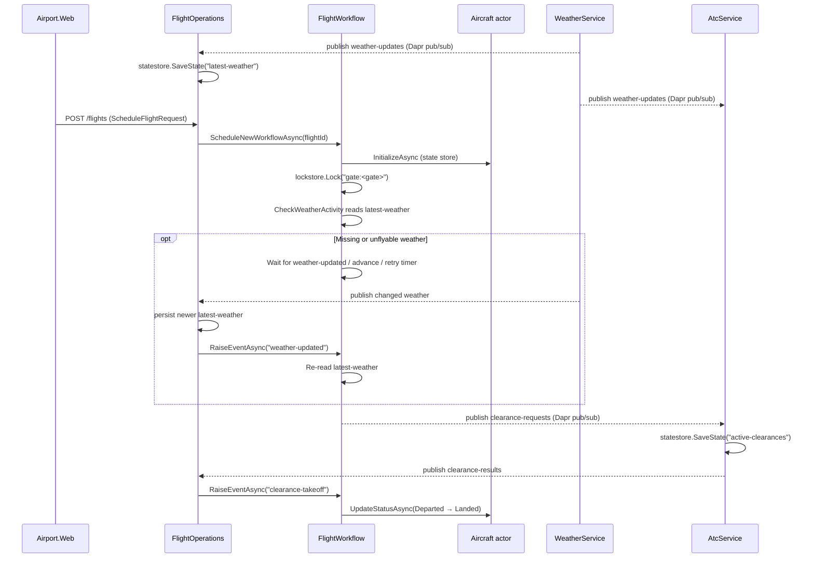

# Airport demo — docs

A small distributed system showcasing **Dapr building blocks** orchestrated by **.NET Aspire**.
The Blazor WASM frontend (`Airport.Web`) calls three backend services; each backend runs with a Dapr sidecar.

## Topology

| Component | Port | Dapr app id | Role |
| --- | --- | --- | --- |
| `Airport.Web` (Blazor WASM) | 5080 | — | Persistent 3D airport + operational panels, HTTP commands/snapshots + SignalR change notifications (no sidecar — browsers can't reach one) |
| `Airport.WeatherService` | 5081 | `weather-service` | Publishes weather snapshots, exposes control HTTP API |
| `Airport.AtcService` | 5082 | `atc-service` | Subscribes to clearance requests, decides, persists active clearances |
| `Airport.FlightOperations` | 5083 | `flight-ops` | Hosts flight workflows + Aircraft actors, consumes weather events, owns the flights HTTP API |

Shared Dapr components (Redis-backed, see [src/dapr/components](../src/dapr/components)):

- `pubsub` — pub/sub topics: `weather-updates`, `clearance-requests`, `clearance-results`, `airport-reset-requests`, `airport-reset-completed`
- `statestore` — Aircraft actor state, flight index, active-clearances map, FlightOperations' `latest-weather` snapshot, ATC's `last-airport-reset` replay cutoff
- `lockstore` — distributed lock per gate (one boarding flight at a time)

## Page → docs map

| Route | Page | Doc |
| --- | --- | --- |
| `/` | Live traffic + 3D airport | [home.md](pages/home.md) |
| `/operations` | Schedule a new flight / clear airport state | [operations.md](pages/operations.md) |
| `/flight/{id}` | Flight detail + operator controls | [pages/flight.md](pages/flight.md) |
| `/atc` | ATC tower view | [pages/atc.md](pages/atc.md) |
| `/weather` | Weather control panel | [pages/weather.md](pages/weather.md) |

## Immersive workspace (all routes)

A locally bundled Three.js airport stays mounted while navigation changes the operational panel. Aircraft reflect actual workflow states; positions and movement are **illustrative, not GPS tracking or a geographically accurate Schiphol model**. No sample aircraft are invented when the flight feed is empty.

The workspace keeps operational controls, live metrics, and camera hints visible without decorative airport headings or simulation captions.

| Action | UI element | Effect |
| --- | --- | --- |
| Orbit / zoom / pan | Drag / scroll or pinch / right-drag in the scene | Local camera only |
| Use keyboard camera controls | Focus the scene, then arrows / `+` / `-` / Home | Orbit / zoom / reset |
| Jump to an airport viewpoint | Airport / Terminal / Runway / Tower | Local camera preset; stops following an aircraft |
| Follow a flight and operate its workflow | Aircraft or aircraft-label click | Opens `/flight/{id}` and follows that aircraft |
| Change lighting | Golden hour / Daylight / Night lights | Visual only; does not change backend time or weather |
| Reduce GPU work | High fidelity / Balanced | Local rendering quality |
| Freeze animation / show aircraft labels | Motion / labels buttons | Visual only; SignalR live updates continue |
| Explore without a panel | Explore airport / Show controls | Hides / restores the operational panel; navigation restores it |
| Recover after a graphics failure | Retry 3D view | Recreates the renderer without restarting backend workflows |

`AirportLiveState` shares snapshots between the scene, summary strip, and panels. It connects directly to each backend's SignalR hub at `/hubs/airport` using WebSockets only (no negotiation or long-polling fallback). After connecting, it reads an initial snapshot. Each service sends a `Changed` notification after a mutation, refreshing only that service's endpoints below; **idle clients make no recurring snapshot requests**. Reads have an 8 s timeout, never overlap within a service, and changes received during a read queue another snapshot.

| Service | Endpoint | Visualization |
| --- | --- | --- |
| FlightOperations | `GET /flights` | Aircraft lifecycle, gate placement, traffic counts |
| WeatherService | `GET /weather/status` | Weather-driven atmosphere, precipitation, visibility, surface appearance; publisher status |
| AtcService | `GET /clearances` | Active runway clearance highlights; expired clearances are removed locally as well |
| AtcService | `GET /atc/weather` | Last subscriber-observed weather on the tower panel |

Flight notifications cover scheduling, actor initialization/status transitions, cancellation and state removal/reset. Actor state is committed before notifying. Weather notifications cover publisher ticks and pause/resume/preset/override changes. ATC notifications cover newer observed weather, granted clearances and reset. Duplicate/out-of-order weather deliveries and repeated pause commands do not trigger refreshes.

Initial connection failures and disconnects retry automatically. Reconnecting reads a fresh snapshot to recover missed changes; disconnected feeds retain their last data but are marked stale. Failed snapshot reads retain data and recover on the next change or the page's **Refresh** button. Manual refresh reads only that page's service. Clearance expiry uses a local one-shot timer to update panels and runway highlights without backend requests. Deployments must support WebSocket upgrades on the configured service URLs.

Failures are surfaced as stale/unavailable data rather than an empty successful response. Last snapshots are retained; unknown clearance data is not displayed as a free runway. Shared reads touch the same actors and state keys as the traffic and tower pages; the scene does not advance workflows or mutate backend state.

Reduced-motion preferences are respected on startup. Motion can be enabled manually. Rendering pauses in hidden tabs, and the scene releases GPU resources when disposed. If WebGL 2 is unavailable or the graphics context is lost, a retry message appears and the operational panels remain usable. Controls and flight selection also work without interacting with the canvas.

The generated `src/Airport.Web/wwwroot/js/airport-scene.js` bundle is checked in, so normal .NET builds and demos need no Node step or runtime CDN. After changing `src/Airport.Web/Scene`, run `npm ci && npm run build` in `src/Airport.Web` and include the generated bundle and license notices.

## End-to-end flow (Operations → Flight → ATC → Weather)



WeatherService publishes to both ATC and FlightOperations; workflows no longer invoke WeatherService over HTTP. The latest received snapshot is durable, so a flight can use weather published before it was scheduled or before FlightOperations restarted. Missing weather is a hold, never an implicit clearance. A change wakes a weather hold immediately; periodic snapshots remain as a heartbeat. Older events are ignored and duplicate delivery does not spend the hold's retry budget.

The workflow uses durable custom status `waiting-for-weather` while reading/waiting for weather. The subscriber signals only running workflows with that status, not boarding timers, cruise waits, or terminal instances. A 60 s fallback recheck and operator **advance** preserve the existing four-retry limit; exhausting it cancels the flight and releases the gate.

Existing workflows already in `FAILED` state are not restarted by publishing weather. Cancel/reschedule those flights after updating the demo; do not flush the shared Redis database, which may hold other applications' state.

To start with an empty airport, use **Clear airport state** on Operations and confirm **Yes, clear everything**. This terminates and purges flight workflows, removes aircraft state, flights and clearances, releases gates/runways and clears cached weather. `AirportResetWorkflow` publishes `airport-reset-requests`; ATC clears its own state and publishes `airport-reset-completed`, which raises the reset workflow's `atc-reset-completed` external event. The button reports success after this acknowledgement, then purges the reset workflow. No backend-to-backend HTTP calls or Redis database flush are needed. ATC retains a durable `last-airport-reset` cutoff to reject pre-reset clearance messages, and duplicate reset events do not clear newer data. Live weather can repopulate its cache on the next publication; publisher pause/preset settings remain unchanged.

## Cross-cutting

- **Observability**: every service uses `Airport.ServiceDefaults` (OpenTelemetry traces + metrics) and registers `AirportTelemetry.Source` / `AirportTelemetry.Meter`. Health checks and SignalR transport requests are excluded from HTTP tracing; actual commands, change-driven snapshot reads, Dapr events and workflow activities remain traced. The weather publisher still emits real periodic snapshots every 60 s. The AppHost generates a Dapr tracing config so sidecar spans land in the Aspire dashboard alongside app spans. See [src/Airport.Contracts/AirportTelemetry.cs](../src/Airport.Contracts/AirportTelemetry.cs).
- **Trace correlation**: `FlightTrace.ContextFor(flightId)` derives a deterministic trace id from the flight id, so every span produced for one flight (across services + workflow activities) joins the same trace.
- **Run locally**: `aspire run` from `src/Airport.AppHost`. Requires `dapr init` to have provisioned Redis on `localhost:6379`.

## SignalR regression scenarios

Run `dotnet run --project src/tests/Airport.Realtime.Tests` from the repository root. Uses the actual UI feed implementation and isolated local ASP.NET Core hubs, with no Docker, Dapr, Redis or extra test packages. Covers zero idle HTTP reads, service-scoped changes, notifications during snapshot reads, stale data, local clearance expiry, manual refresh, disconnect/reconnect catch-up, reset, initial connection retries and transport trace filtering.

## Weather workflow integration scenarios

With the local airport running and no active flight workflows, find the `flight-ops` HTTP port using `dapr list`, then run from `src`:

```sh
AIRPORT_WEATHER_INTEGRATION=1 AIRPORT_FLIGHT_DAPR_URL=http://localhost:<flight-ops-sidecar-port> \
  node --test tests/weather-events.test.mjs
```

Uses Node's built-in test runner (no additional packages). The opt-in scenarios temporarily control weather and clear only the `latest-weather` snapshot to exercise missing-weather behavior. They create diagnostic flights, cover duplicates/out-of-order events, immediate wake-up, cached weather, manual advancement, cancellation/gate release, and landing, then remove their own flight state and restore the original weather controls. Existing flight history and unrelated Redis data are retained.

## Airport reset integration scenario

On an **isolated, empty local demo** (this test clears all airport flights and clearances), run from `src`:

```sh
AIRPORT_RESET_INTEGRATION=1 \
  AIRPORT_FLIGHT_DAPR_URL=http://localhost:<flight-ops-sidecar-port> \
  AIRPORT_TOWER_DAPR_URL=http://localhost:<atc-service-sidecar-port> \
  node --test tests/state-reset.test.mjs
```

The opt-in scenario covers active/cancelled/pending flights, waiting for a gate, unindexed workflows, workflow/actor deletion, late clearance messages, repeat/duplicate resets, unrelated state retention, reusing gates/runways and the pub/sub → workflow external-event round trips for takeoff and landing. Run without the weather publisher to keep the weather cache empty during assertions. `AIRPORT_FLIGHTS_URL` and `AIRPORT_TOWER_URL` optionally override the default HTTP ports.
