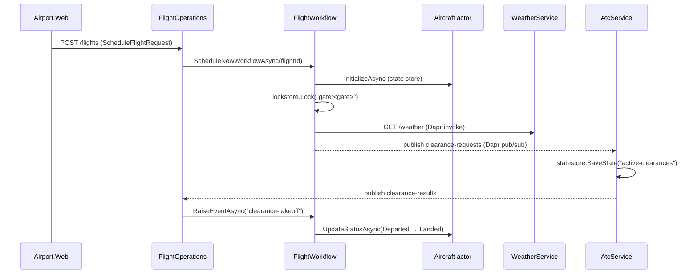

# Airport demo — docs

A small distributed system showcasing **Dapr building blocks** orchestrated by **.NET Aspire**.
The Blazor WASM frontend (`Airport.Web`) calls three backend services; each backend runs with a Dapr sidecar.

## Topology

| Component | Port | Dapr app id | Role |
| --- | --- | --- | --- |
| `Airport.Web` (Blazor WASM) | 5080 | — | UI, calls services over HTTP (no sidecar — browsers can't reach one) |
| `Airport.WeatherService` | 5081 | `weather-service` | Publishes weather snapshots, exposes control HTTP API |
| `Airport.AtcService` | 5082 | `atc-service` | Subscribes to clearance requests, decides, persists active clearances |
| `Airport.FlightOperations` | 5083 | `flight-ops` | Hosts the flight workflow + Aircraft actor, owns the flights HTTP API |

Shared Dapr components (Redis-backed, see [src/dapr/components](../src/dapr/components)):

- `pubsub` — pub/sub topics: `weather-updates`, `clearance-requests`, `clearance-results`
- `statestore` — Aircraft actor state, flight index, active-clearances map
- `lockstore` — distributed lock per gate (one boarding flight at a time)

## Page → docs map

| Route | Page | Doc |
| --- | --- | --- |
| `/` | Departure board | [home.md](pages/home.md) |
| `/operations` | Schedule a new flight | [operations.md](pages/operations.md) |
| `/flight/{id}` | Flight detail + operator controls | [pages/flight.md](pages/flight.md) |
| `/atc` | ATC tower view | [pages/atc.md](pages/atc.md) |
| `/weather` | Weather control panel | [pages/weather.md](pages/weather.md) |

## End-to-end flow (Operations → Flight → ATC → Weather)

## Cross-cutting

- **Observability**: every service uses `Airport.ServiceDefaults` (OpenTelemetry traces + metrics) and registers `AirportTelemetry.Source` / `AirportTelemetry.Meter`. The AppHost generates a Dapr tracing config so sidecar spans land in the Aspire dashboard alongside app spans. See [src/Airport.Contracts/AirportTelemetry.cs](../src/Airport.Contracts/AirportTelemetry.cs).
- **Trace correlation**: `FlightTrace.ContextFor(flightId)` derives a deterministic trace id from the flight id, so every span produced for one flight (across services + workflow activities) joins the same trace.
- **Run locally**: `aspire run` from `src/Airport.AppHost`. Requires `dapr init` to have provisioned Redis on `localhost:6379`.
