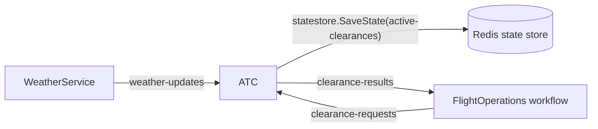

# `/atc` — ATC tower

**File:** [src/Airport.Web/Pages/Atc.razor](../../src/Airport.Web/Pages/Atc.razor)

Read-only panel over the persistent 3D airport, showing **AtcService** state and active runway highlights. Confirms that the pub/sub round trip works end-to-end.

## What the user can do

| Action | UI element | Calls |
| --- | --- | --- |
| See active runway clearances | Auto-loaded table (polls every 2 s) | `GET /clearances` |
| See the last weather snapshot ATC received | Card at the bottom | `GET /atc/weather` |
| Refresh now | **Refresh** button | both endpoints above |
| Follow a cleared flight | Callsign link or aircraft selection | navigates to `/flight/{flightId}` |
| View runways or tower in 3D | Runway / Tower camera presets | local camera only; [workspace controls](../README.md#immersive-workspace-all-routes) |

Each clearance row shows callsign, kind (Takeoff/Landing badge), runway, granted-at, and expires-at. Rows disappear automatically when `ExpiresAt` (15 s after granting) passes — the server filters them.

## Backend interactions

Tower calls go to **AtcService** (`http://localhost:5082`) via `AtcApi` ([Services/ApiClients.cs](../../src/Airport.Web/Services/ApiClients.cs)). Shared polling also reads `GET /flights` and `GET /weather/status` to drive aircraft and weather; see the [shared feed table](../README.md#immersive-workspace-all-routes).

| Endpoint | Server behavior |
| --- | --- |
| `GET /clearances` | Reads `statestore` key `active-clearances` (a `Dictionary<flightId, ActiveClearance>`), drops expired entries, sorts by `GrantedAt`. |
| `GET /atc/weather` | Returns the in-memory last `WeatherSnapshot` from the `WeatherWatch` singleton. |

The UI filters expired entries as well. Stale/unavailable feeds are identified explicitly; an unavailable tower is not presented as an all-clear runway. The scene uses two illustrative physical runway strips (`09L`/`27R` and `09R`/`27L`); backend clearance records remain authoritative.

## Where the data comes from

ATC decisions and airport resets react to pub/sub; no synchronous backend-to-backend HTTP calls are needed.

Subscriber handlers in [services/Airport.AtcService/Program.cs](../../src/services/Airport.AtcService/Program.cs):

- `POST /atc/weather-updates` → updates `WeatherWatch.Latest` only for a newer `ObservedAt` (subscribes to `weather-updates`). Duplicate/out-of-order delivery cannot revert the tower to older conditions.
- `POST /atc/clearance-requests` → makes a decision, persists it in `active-clearances`, and publishes the result on `clearance-results` (subscribes to `clearance-requests`). The persisted reset cutoff rejects requests with `RequestedAt` at/before the last reset without reserving a runway or writing a clearance. FlightOperations raises the corresponding takeoff/landing external event on the flight workflow.
- `POST /atc/airport-reset` → subscribes to `airport-reset-requests`; atomically deletes `active-clearances` and stores the reset cutoff in `last-airport-reset`, then frees runway reservations and clears tower weather. Publishes `airport-reset-completed` with the reset workflow id, allowing FlightOperations to raise its completion event. Duplicate/older reset messages only repeat the acknowledgement; they do not clear new state.

Clearance handling and reset share a gate so an in-flight decision cannot restore stale clearances after reset.

## Decision logic

In `POST /atc/clearance-requests`:

1. If the last observed weather is **not flyable** → deny with reason `Below minima: ...`.
2. Else try to reserve a runway from `RunwayBoard` (`09L`, `09R`, `27L`, `27R`, busy for 15 s after grant). Denies with `All runways occupied — hold short` if none are free.
3. On grant, persist a new entry into the `active-clearances` map (15 s `ExpiresAt`) and publish on `clearance-results`.

## Dapr building blocks touched

- **Pub/sub** — subscriptions: `weather-updates`, `clearance-requests`, `airport-reset-requests`; publishes: `clearance-results`, `airport-reset-completed`.
- **State store** — `active-clearances` map and the durable `last-airport-reset` replay cutoff. The cutoff remains after a reset so late clearance messages cannot restore old state.

The tower panel only reads HTTP views; service coordination uses events, not Dapr service invocation or Aspire-discovered peer HTTP calls.

FlightOperations independently consumes `weather-updates` to wake its weather holds. ATC still receives and evaluates its own subscription; no WeatherService HTTP invocation is needed.

## Telemetry

- Span `atc.decide_clearance` (`Consumer` kind, parent context = `FlightTrace.ContextFor(flight.id)`) wraps each decision so it joins the per-flight trace.
- Metrics: `ClearanceDecisions` counter + `ClearanceDecisionDurationMs` histogram, tagged with `clearance.kind`, `clearance.granted`, `runway`.
