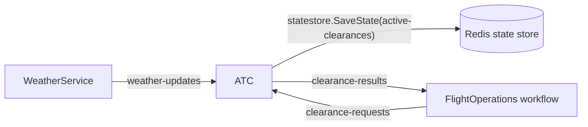

# `/atc` — ATC tower

**File:** [src/Airport.Web/Pages/Atc.razor](../../src/Airport.Web/Pages/Atc.razor)

Read-only view of the **AtcService**'s current state. Confirms that the pub/sub round trip works end-to-end.

## What the user can do

| Action | UI element | Calls |
| --- | --- | --- |
| See active runway clearances | Auto-loaded table (polls every 2 s) | `GET /clearances` |
| See the last weather snapshot ATC received | Card at the bottom | `GET /atc/weather` |
| Refresh now | **Refresh** button | both endpoints above |

Each clearance row shows callsign, kind (Takeoff/Landing badge), runway, granted-at, and expires-at. Rows disappear automatically when `ExpiresAt` (15 s after granting) passes — the server filters them.

## Backend interactions

All calls go to **AtcService** (`http://localhost:5082`) via `AtcApi` ([Services/ApiClients.cs](../../src/Airport.Web/Services/ApiClients.cs)).

| Endpoint | Server behavior |
| --- | --- |
| `GET /clearances` | Reads `statestore` key `active-clearances` (a `Dictionary<flightId, ActiveClearance>`), drops expired entries, sorts by `GrantedAt`. |
| `GET /atc/weather` | Returns the in-memory last `WeatherSnapshot` from the `WeatherWatch` singleton. |

## Where the data comes from

ATC has **no inbound HTTP path** for writes; it only reacts to pub/sub:

Subscriber handlers in [services/Airport.AtcService/Program.cs](../../src/services/Airport.AtcService/Program.cs):

- `POST /atc/weather-updates` → updates `WeatherWatch.Latest` (subscribes to `weather-updates`).
- `POST /atc/clearance-requests` → makes a decision, persists it in `active-clearances`, publishes the result on `clearance-results` (subscribes to `clearance-requests`).

## Decision logic

In `POST /atc/clearance-requests`:

1. If the last observed weather is **not flyable** → deny with reason `Below minima: ...`.
2. Else try to reserve a runway from `RunwayBoard` (`09L`, `09R`, `27L`, `27R`, busy for 15 s after grant). Denies with `All runways occupied — hold short` if none are free.
3. On grant, persist a new entry into the `active-clearances` map (15 s `ExpiresAt`) and publish on `clearance-results`.

## Dapr building blocks touched

- **Pub/sub** — two subscriptions (`weather-updates`, `clearance-requests`) and one publish (`clearance-results`).
- **State store** — `active-clearances` map (read by this page, written by the request handler).

## Telemetry

- Span `atc.decide_clearance` (`Consumer` kind, parent context = `FlightTrace.ContextFor(flight.id)`) wraps each decision so it joins the per-flight trace.
- Metrics: `ClearanceDecisions` counter + `ClearanceDecisionDurationMs` histogram, tagged with `clearance.kind`, `clearance.granted`, `runway`.
